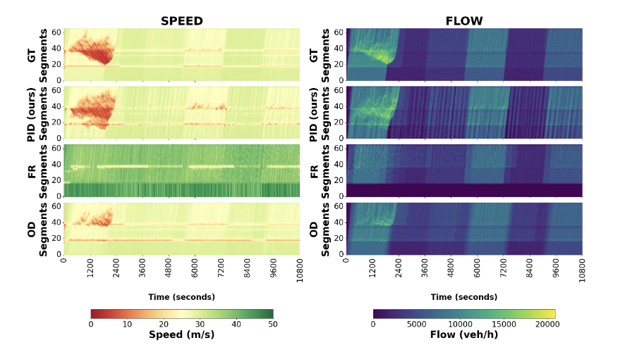

# **SUMO-in-the-loop Corridor Calibration (with PID control!)**  

[](LICENSE)  
 

This work is an extension of the following repository that adds on a PID method: https://github.com/yanb514/CorridorCalibration

which contains the code used for this paper:
```
@misc{wang2024calibrating,
  title={Calibrating Microscopic Traffic Models with Macroscopic Data},
  author={Wang, Yanbing and de Souza, Felipe and Zhang, Yaozhong and Karbowski, Dominik},
  note={https://ssrn.com/abstract=5065262},
  year={2024}
}
```
Please refer to the CorridorCalibration repository for initial setup instructions
---

## **Setup**  
- [Package Dependencies](#package-dependencies)
- [Simulation Files](#simulation-files)  
- [Plotting Files](#plotting-files)  
- [Relevant Directories](#relevant-directories)      

---
## **Package Dependencies**
This project is managed using uv, a fast Python package installer and resolver.
Prerequisites
Ensure you have uv installed on your system:
```
# Using curl (macOS/Linux)
curl -LsSf https://astral.sh/uv/install.sh | sh

# Using pip
pip install uv
```

To install the project and all required dependencies into a synchronized virtual environment, run the following command in the root directory:
```
uv sync
```
This will automatically read the pyproject.toml and create a locked virtual environment in .venv/.

## **Simulation Files**  
The simulation files for the onramp, i24, and i24b scenarios are the following
- /sumo/onramp/onramp_calibrate_PID.py
- /sumo/i24/i24_calibrate_PID.py
- /sumo/i24b/i24b_calibrate_PID.py
---
The onramp scenario only supports synthetic data, while the i24 and i24b scenario support real and synthetic data.

The i24 scenario supports the PID method, an OD Estimation method adapted from the CorridorCalibration project, and a flowrouter baseline comparison.

To toggle between real and synthetic data, and the different methods supported, ctrl-f for this block of code:
```
RERUN_GT = False # whether to rerun the ground truth simulation and regenerate synthetic measurements (set to False to save time if already done)
REAL_DATA = False
method = "PID" # or "FLOWROUTER" "OD_ESTIMATION"
```
and correct the field to your desired configuration.

The i24b scenario supports only flowrouter, the od_estimation method in that file is not functional. Additionally, through obtaining a fcd output file from the microsim calibration benchmark library (currently private) one can obtain a comparison between the PID method and genetic algorithm by using it in the data analysis and plotting methods.

File output naming convention (this will be in the appropriate method directory, example: sumo/onramp/fcd_output/fcd_pid_sim_3hr.xml)

**fcd_output/fcd_pid_sim_3hr.xml** - fcd file output from pid method

**pid_log_sim_3hr.csv** - log of observed vehicle count versus actual at controlled sensors from pid method

**fcd_output/fcd_fr_sim_3hr.xml** - fcd file output from flowrouter method

**fr_log.csv** - log of observed vehicle count versus actual at controlled sensors from flowrouter method

**fcd_output/fcd_od_sim_3hr.xml** - fcd file output from od method

**od_log.csv** - log of observed vehicle count versus actual at controlled sensors from od estimation method

Following this naming convention, should you also want to compare genetic algorithm, or any other method on the i24b benchmark, add your fcd file to fcd_output in the appropriate directory. You will also need to write a method to turn an out.xml file, or whatever seems most useful, into the similar csv files as above.

## **Plotting Files**

/sumo/utils_vis_PID.py is the primary file responsible for generating time space .npy files, that can be further visualized however the user likes.

You must ctrl-f for "SCENARIO =" and replace the field for the scenario you are using. Then in config.json, in the part of the file that has the metadata for the scenario, change the field "METHOD_TYPE:" to the method you are using. Example: I set the scenario to be "SCENARIO = i24" and want to use the OD estimatioin method configure the config.json file like this:

```
...
"i24":{
        "SIMULATION_TIME": 10800,
        "N_ROUTES": 5,
        "N_INTERVALS": 12,
        "RDS_DIR": "REPLACE_WITH_YOUR_LOCAL_RDS_PATH",
        "STEP_LENGTH": 0.1,
        "DETECTOR_INTERVAL": 30,
        "DETECTOR_FILE": "i24_RDS_gt.add.xml",
        "METHOD_TYPE": "OD",
        "NET_FILE": "i24.net.xml",
        "IS_RDS": false
    }
...
```
The possible flags are "PID", "OD", "FR", "GA".


## **Command-Line Arguments**

The simulation script accepts command-line flags to customize file paths and output locations. If no arguments are provided, it defaults to the `onramp` scenario directories.

### **Available Options**

| Flag | Type | Default Value | Description |
| --- | --- | --- | --- |
| `--plot_dir` | `str` | `"onramp/figures/temp/"` | The directory where generated evaluation and PID control plots will be saved. |
| `--data_dir` | `str` | `"onramp/data/"` | The directory where the required simulation data and network files are located. |

### **Usage Examples**

**Run with defaults:**

```bash
uv run python utils_vis_PID.py

```

**Customizing output directories:**

```bash
uv run python utils_vis_PID.py --plot_dir "sumo/i24b/figures/scenario1_fr/" --data_dir "sumo/i24b/"

```

To make it easier for the user, I have made it so that all files used for plotting are copied into the relevant directory for reuse. If the directory is already there, it will just use those files again. If you want to write over those files however, but use the same file name, set the flag "rerun_sim = true"


In the main control flow block, you can run the main method, or the generate_master_stacked_plot method (see below):

```
if __name__ == "__main__":

    # 1. Initialize the parser
    parser = argparse.ArgumentParser(description="Run on-ramp simulation and save plots.")

    # 2. Add the argument as a keyword (using the -- flag)
    parser.add_argument(
        "--plot_dir", 
        type=str, 
        default="onramp/figures/temp/",
        help="Directory where figures will be saved"
    )

    parser.add_argument(
        "--data_dir", 
        type=str, 
        default="onramp/data/",
        help="Directory where data files are located"
    )

    # 3. Parse the arguments
    args = parser.parse_args()

    # 4. Access the value using args.plot_dir
    if not os.path.exists(args.plot_dir):
        os.makedirs(args.plot_dir)
        print(f"Created new directory: {args.plot_dir}")


    main(plot_dir=args.plot_dir, data_dir=args.data_dir)
    #generate_master_stacked_plot(base_dir = args.data_dir, is_rds=False)
```

The main method generates the npy file for that particular method and scenario and puts it in your figure directory. If you were to put all the npy files from this process in one directory and give them appropriate unique names like the following (this is an example from this repository)

CorridorCalibrationPID/sumo/plot_data/large/scenario1/
- fr/
---flow_pid.npy
---flow_sim.npy
---speed_pid.npy
---speed_sim.npy
- od/
---flow_pid.npy
---flow_sim.npy
---speed_pid.npy
---speed_sim.npy
- pid/
---flow_pid.npy
---flow_sim.npy
---speed_pid.npy
---speed_sim.npy

The generate_master_stacked_plot method will take in the directory where the "fr", "ga", and "pid" folders are held bia the --data_dir flag (in this case: CorridorCalibrationPID/sumo/plot_data/large/scenario1) and generate the stacked plots on top of each other.

You control the methods that are plotted using this field: "methods = ["pid", "fr", "od"]", where the strings must match the folder names. That field also determines the name of each section of the plot, but in uppercase (example below, GT stands for ground truth)




